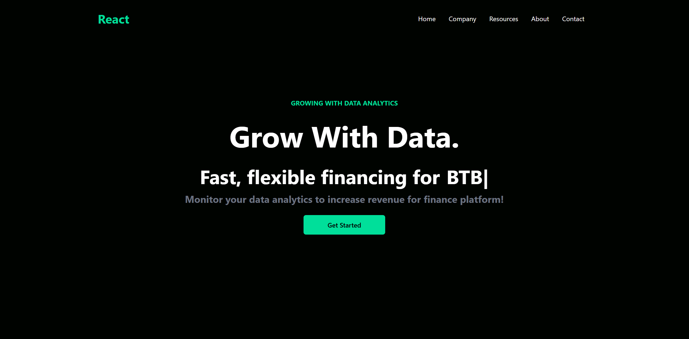

# ✨ Data Finance  ✨

A sleek and modern React application built with Tailwind CSS. This project provides a visually appealing and responsive user interface for a data finance platform.

## 🚀 Features

*   **Interactive Navigation:**  A dynamic navbar that adapts to different screen sizes for seamless navigation.
*   **Engaging Hero Section:**  A captivating hero section with a dynamic typing effect to highlight key messages.
*   **Informative Analytics Section:**  A section dedicated to showcasing data analytics features with a clear call to action.
*   **Subscription Newsletter:** A newsletter signup form to keep users engaged and informed.
*   **Pricing Cards:**  Visually appealing cards to present different pricing options.
*   **Responsive Design:**  Ensures a consistent and optimal user experience across all devices.

## 💻 Technologies Used

*   **React:**  A JavaScript library for building user interfaces.
*   **Tailwind CSS:** A utility-first CSS framework for rapid UI development.
*   **React Typed:** A library for creating dynamic typing effects.

## 🛠️ Installation

1.  Clone the repository:
    ```bash
    git clone https://github.com/FFF9ep/Data-Finance.git
    ```
2.  Navigate to the project directory:
    ```bash
    cd data-finance
    ```
3.  Install dependencies:
    ```bash
    npm install
    ```

## ▶️ Usage

1.  Start the development server:
    ```bash
    npm start
    ```
2.  Open your browser and visit `http://localhost:3000`

## 🖼️ Screenshots



## 🤝 Contributing

Contributions are welcome! If you find any bugs or have suggestions for improvements, please feel free to open an issue or submit a pull request.

**Steps to Contribute**:
1. 🪝 Fork the repo.
2. Create a new 🆕 branch (`git checkout -b feature/your-feature`).
3. Commit your changes (`git commit -m 'Add some feature'`).
4. Push to the branch (`git push origin feature/your-feature`).
5. Open a 📝 Pull Request.

## 📄 License

This project is licensed under the MIT License.

---

## 🙏 Acknowledgments
Hat tip to anyone whose code was used
Inspiration
etc

## 📬 Contact
Got questions? Reach out to me!

Email: fandardyy@gmail.com
Linkedln: https://www.linkedin.com/in/fandiardyan111/


Made with ❤️ and ☕ by Fandi